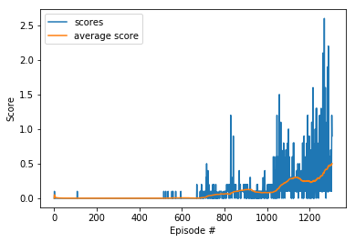

# Report

## Summary

This project implement a Deep Deterministic Policy Gradients (DDPG) as described in this [paper](https://arxiv.org/pdf/1509.02971.pdf). 
DDPG agent will atempt to solve Unity Tennis Environment 
The Goal of the agent is to play tennis

## Environment Info

- `Number of agents: 2` 
- `Number of actions: 2` 
- `State Length : 24 (Every Agent)`  

## Benchmark 
Reward from each agent is added without discounting and max award (from both agents) is set as episode reward 
The problem is considered solved when the agents achieve average reward of 0.50+ over 100 consecutive episodes

## Parameter Values

- BUFFER_SIZE: 100000
- MAX_TIMESTEPS_EACH_EPISODE: 1000
- LEARNING_RATE: 1e-4 Both Networks
- GAMMA: 0.99
- WEIGHT_DECAY: 0
- TAU: 1e-3
- BATCH_SIZE: 128

## Network Info

### Actor
- Linear Layer:
    - Input Size: Observation Space = 33
    - Output Size: 256
    - Activation: [Rectifier](https://en.wikipedia.org/wiki/Rectifier_(neural_networks))

- Linear Layer:
    - Input Size: 256
    - Output Size: 128
    - Activation: [Rectifier](https://en.wikipedia.org/wiki/Rectifier_(neural_networks))

- Linear Layer:
    - Input Size: 128
    - Output Size: Action Space = 4
    - Activation: [Hyperbolic tangent](https://en.wikipedia.org/wiki/Hyperbolic_function#Hyperbolic_tangent)

### Critic
 - Linear Layer:
    - Input Size: Observation Space = 33
    - Output Size: 256
    - Activation: [Rectifier](https://en.wikipedia.org/wiki/Rectifier_(neural_networks))

- Linear Layer:
    - Input Size: 256 + (Action Space = 4)
    - Output Size: 128
    - Activation: [Rectifier](https://en.wikipedia.org/wiki/Rectifier_(neural_networks))

- Linear Layer:
    - Input Size: 128
    - Output Size: 1
    - Activation: [Rectifier](https://en.wikipedia.org/wiki/Rectifier_(neural_networks))

## Scores
`Environment solved in 1303 episodes!	Average Score: 0.50`

## Future Plans

- Tryout different initial weights to measure impact on training time
- Try various MADDPG models to see performance diffrence
- Tryout soccer environment with same model

## Remarks

DDPG Agent described in paper above seems to be working perfectly for collaboartion and competition tasks

